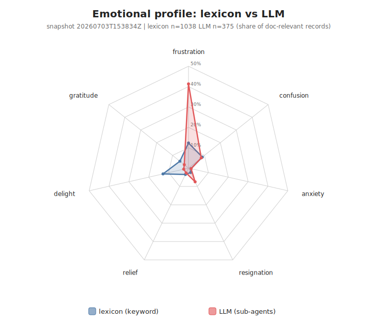
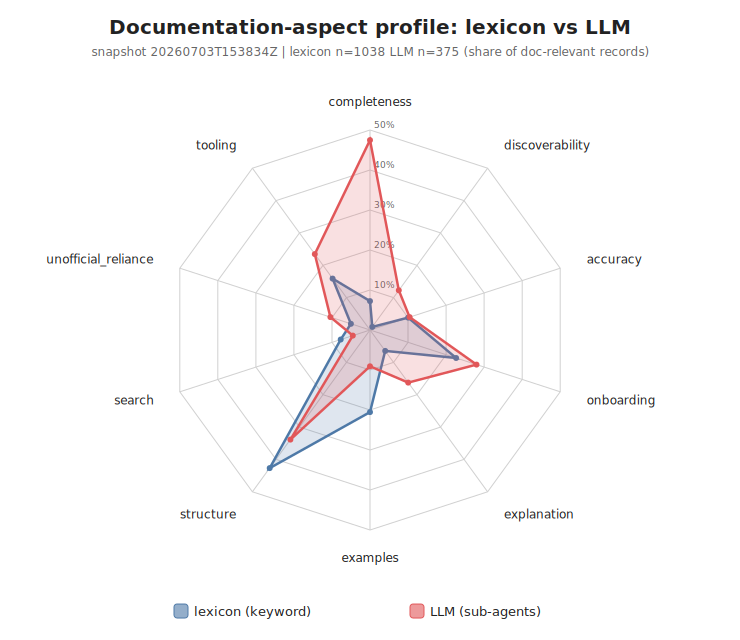
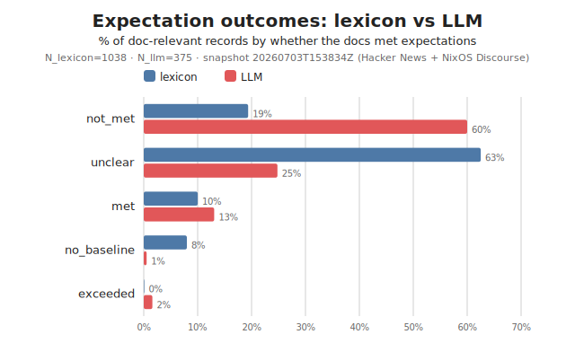

# nixdoc-sentiment

Reproducible sentiment analysis of what people feel and expect about the
**NixOS documentation** — built to be re-run every few months so you can see how
that sentiment changes over time.

> **Status: community analysis — not an official NixOS report.** Produced by python
> `nixdoc-sentiment` tool; **not affiliated with or endorsed by the NixOS
> Foundation or the documentation team.** The **findings and recommendations
> below are LLM-assisted and directional, not ground truth**; they are meant to
> point maintainers at where to look, not to quantify quality precisely.
>
> **Report card** · snapshot `20260703T153834Z` (collected 2026-07-03) · corpus:
> Hacker News + NixOS Discourse, **complaint-skewed** (people post about docs when
> annoyed) · lexicon N=1038, LLM N=375 · lexicon scheme `1.1.0`, LLM pass `llm-1`
> (non-deterministic; see [Limitations](#limitations-read-before-trusting-numbers)).
>
> **Reproduce:** lexicon pipeline `nix run . -- run`; LLM cross-check method and
> rubric in [`docs/LLM_METHOD.md`](docs/LLM_METHOD.md); audit every LLM label
> against its source text with `python scripts/audit_llm.py`. Full usage below.

## Findings: keyword lexicon vs LLM (snapshot 2026-07-03)

The reproducible pipeline scores feedback with a fast, transparent **keyword
lexicon**. As a cross-check, the same 1177-record snapshot (`20260703T153834Z`,
Hacker News + NixOS Discourse) was independently re-classified by an **LLM**
(20 parallel sub-agents) that can weigh negation, sarcasm, and — critically —
*sentiment target*: praise of an alternative (the *unofficial* NixOS Wiki or a
third-party blog) is not delight about the **official** docs. The charts below
show each label's share of doc-relevant records.

| indicator | lexicon | LLM |
| --- | --- | --- |
| records judged doc-relevant | 1038 | **375** |
| mean polarity | **+0.16** | **−0.24** |
| not-met rate | 19% | **60%** |
| delight (share) | 12.8% | **2.4%** |
| frustration (share) | 12.3% | **41.3%** |
| polarity sign agreement (shared-relevant records) | — | **35%** |







**Takeaways.**

- The lexicon's relevance gate over-includes ~3×: any mention of
  "docs/manual/learning" counts.
- On genuine feedback, sentiment **flips from mildly positive to net negative**.
- The LLM reads far more frustration, almost no delight, and ~60% *unmet*
  expectations.
- **Completeness** (missing/undocumented things) is the dominant complaint — badly
  undercounted by keywords (7% → 48%).

**Caveats.**

- The LLM is a different instrument, not ground truth.
- It is **non-deterministic** — re-running gives different numbers.
- So it stays out-of-band (`data/labeled_llm/`); the lexicon is the instrument for
  *trends*.
- Both methods read the same complaint-skewed corpus, so the method-vs-method
  comparison is fair even if absolute negativity is inflated.
- Method + rubric: [`docs/LLM_METHOD.md`](docs/LLM_METHOD.md). Charts:
  `python scripts/make_charts.py` (stdlib only).

## Excerpts (why the numbers look the way they do)

All quotes below are verbatim from the snapshot; whitespace is normalized and
each links to its source. They are complaint-skewed by construction (see the
report card) — they show *what the pain sounds like*, not its prevalence.

### Why keyword scoring breaks down

The lexicon scores tokens, so it cannot tell *who* a word is about, whether it is
negated, or whether it is even the word it thinks. Four real records the keyword
classifier got backwards:

> “I'd love NixOS more if they had any decent documentation. Everything seems
> scattered around a dozen forums, a hundred old blog posts, and a thousand issues
> of ‘this work on my machine (3 releases ago)’.”
> — [HN 47480472](https://news.ycombinator.com/item?id=47480472)

The word `love` fires, so the lexicon labels this **delight, polarity +1.00,
expectation met**. It is a *conditional* — the reader would love NixOS *if the
docs were decent*, i.e. they are not. Human/LLM reading: **frustration, not-met,
−0.70**.

> “The language is alright, the documentation and rate at which things change is
> the issue. You wanted to do something and found a page about how to do it? Cool,
> good chance it won't work anymore cause it changed.”
> — [HN 42813383](https://news.ycombinator.com/item?id=42813383)

The lexicon sees `good` (in “**good** chance it won't work”) and scores
**+1.00**. It is a wrong-word-sense match on a sentence about staleness. LLM:
**frustration + resignation, accuracy/completeness, −0.60**.

> “Its documentation simply sucks. Once you grasp the idea, it feels almost
> great.” — [HN 44786556](https://news.ycombinator.com/item?id=44786556)

`sucks` is not in the polarity lexicon; `great` (describing *the idea*, not the
docs) is — so this scores **+1.00**. LLM: **frustration, completeness, −0.50**.

> “@ryantm I might be interested!”
> — [Discourse, doc-team meeting thread](https://discourse.nixos.org/t/2023-03-14-documentation-team-meeting-notes-32/26351/3)

No sentiment at all — but the thread title contains “documentation”, so the
relevance gate keeps it. This is the over-inclusion that inflates the lexicon’s
denominator from **375 → 1038**: forum logistics counted as documentation
feedback.

### What the complaints actually say

The recurring problem, in users’ own words, grouped by the facet the LLM assigned.

**Completeness — the thing needed wasn’t there.**

> “Nix in general has some of the worst documentation I've ever encountered.”
> — [HN 44900388](https://news.ycombinator.com/item?id=44900388)
>
> “I followed the official NixOS documentation … which is… scarce, to say the
> least. But it also basically worked just like that.”
> — [HN 45972851](https://news.ycombinator.com/item?id=45972851)

**Accuracy / staleness — what is written no longer matches reality.**

> “… the best we got is a mishmash of unofficial recourses and many of them are
> out of date and/or focus on the packaging side which is terrible for
> introduction.” [sic]
> — [HN 48590064](https://news.ycombinator.com/item?id=48590064)
>
> “There are two NixOS wikis. … wiki.nixos.org claims that nixos.wiki is outdated
> and unofficial. But both appear to receive updates, and which one wins the SEO
> game is a coinflip whenever i google a nixos question.”
> — [HN 47480587](https://news.ycombinator.com/item?id=47480587)

**Onboarding / explanation — the *why* is missing.**

> “I daily drive nixos and I have no idea what specializations are and reading
> that wiki article didn't help. Am I just looking at a way to drop in chunks of
> predefined config?” — [HN 48224637](https://news.ycombinator.com/item?id=48224637)
>
> “Nix is incredibly complicated to get into … the abysmal DSL and documentation.
> Every company we’ve tried to introduce it in has failed to adopt it primarily
> due to its incredibly steep learning curve.”
> — [HN 41419662](https://news.ycombinator.com/item?id=41419662)

**Unofficial reliance — falling back to source code and blogs.**

> “I was looking through nix package code to sort out issues with nix on Hyper-V.
> I really like Nix so far … but damn is the documentation ever shit tier.”
> — [HN 36680565](https://news.ycombinator.com/item?id=36680565)

These are exactly the records the lexicon tends to misread — note that two of them
(`love`, `like`) contain positive tokens the keyword scorer would credit to the
docs.


## Recommendations from this snapshot

> These recommendations are **derived from the LLM cross-check** (N=375), an
> LLM-assisted read of a complaint-skewed corpus. They are **directional
> prioritisation, not measurement** — use them to decide *where to look first*.
> Where a facet's sample is small (n<40), the percentages are noisy; those cases
> are flagged inline and should be read as "worth investigating," not settled.

Ranking the ten documentation facets by the LLM cross-check (which weighs
sentiment *target*, so praise of the unofficial wiki is not counted as praise of
the official docs) surfaces three signals both methods agree on. Each is stated
with the metric that should move in the **next** snapshot if the fix lands — that
is the whole point of freezing the lexicon: the recommendations are falsifiable.

### 1. Close coverage gaps — `completeness` is the dominant complaint

*Pointer.* Completeness is the single most-discussed facet in the LLM read
(178 of 375 doc-relevant records, ~47%), mean polarity **−0.36**, **80%**
not-met. It is also the lexicon's worst not-met aspect (**52%**), so both
instruments agree despite disagreeing on everything else. People are not saying
the docs are badly written — they are saying the thing they needed *was not
there*.

*Fix.* Treat reference completeness as a build gate: assert every NixOS module
option and CLI flag has a description **and** at least one runnable example, and
author task-oriented "how do I X" recipes for the highest-frequency gaps in the
corpus. Missing coverage is mechanically detectable; make CI fail on it.

*Verify next run.* `completeness` `not_met_rate` and its share of records fall.

### 2. Fix staleness — `accuracy` is the sharpest quality defect

*Pointer.* Accuracy is the **most negative** facet (**−0.48**) and the highest
not-met rate (**87%**) in the LLM read — but on a **small sample (n=39)**, so
treat the magnitude as directional. It travels with `unofficial_reliance`
(n=39, 77% not-met, −0.32): when the official page is wrong or outdated, users
fall back to the community NixOS Wiki and blog posts, which is exactly the
dependency the official docs should remove. Completeness (n=178) is the
higher-confidence signal; accuracy is the sharper but thinner one.

*Fix.* Make every code sample executable and test it in CI against the pinned
nixpkgs the manual is built from (doctest-style), stamp each page with the
revision it was validated at, and run a staleness bot that flags pages untouched
across N releases. Correctness regressions then surface at build time, not on
Hacker News.

*Verify next run.* `accuracy` mean polarity and `unofficial_reliance` share
improve.

### 3. Build a conceptual onboarding path — `onboarding` + `explanation`

*Pointer.* Onboarding (105 records, **71%** not-met, −0.29) and explanation
(61 records, **74%** not-met, −0.36) form a cluster: newcomers cannot find the
*why* (derivations, the store, channels-vs-flakes), and frustration is the
dominant feeling overall (**41%** of LLM records). Reference material exists;
the guided path from zero does not.

*Fix.* Maintain a single linear "learn Nix concepts" track linked from the top
of the manual, pairing each concept with a minimal runnable example, so the
canonical first-hour path is official rather than a scattered set of third-party
tutorials.

*Verify next run.* `onboarding` / `explanation` not-met rates and the
`frustration` share fall.

## How it works

Collects public feedback from several sources, then codes each item on three
orthogonal axes plus a signed polarity score:

1. **Aspect** — which facet of the docs the feedback is about: `discoverability`,
   `completeness`, `accuracy`, `onboarding`, `explanation`, `examples`,
   `structure`, `search`, `unofficial_reliance`, `tooling`.
2. **Feeling** — emotional tone: `frustration`, `confusion`, `anxiety`,
   `resignation`, `relief`, `delight`, `gratitude`.
3. **Expectation** — whether the docs met the reader's expectation:
   `met` / `not_met` / `exceeded` / `no_baseline` / `unclear`.
4. **Polarity** — a signed score in `[-1, 1]`.

Per-aspect `mean_polarity` and `not_met_rate` are the headline "where are we
meeting vs not meeting expectations" indicators.

Two instruments read the **identical** text so they can be compared directly:

- **Lexicon** (`nixdoc_sentiment/categories.py`, versioned by `SCHEME_VERSION`) —
  deterministic and explainable; the **instrument of record** for trends.
- **LLM cross-check** ([`docs/LLM_METHOD.md`](docs/LLM_METHOD.md)) — an
  out-of-band sanity check that understands subject, negation, and sarcasm;
  **non-deterministic and directional only**, never used for trend tracking.

## Sources

| Source | Auth | Notes |
| --- | --- | --- |
| Hacker News (Algolia) | none | Global, so queries are NixOS-scoped. |
| NixOS Discourse | none | `discourse.nixos.org` search + full topics. |
| GitHub issues (`NixOS/nix.dev`) | optional `GITHUB_TOKEN` | Unauthenticated works but is rate-limited; set a token for real runs. |
| Reddit (`r/NixOS`) | optional OAuth | Public JSON is blocked from datacenter IPs; set `REDDIT_CLIENT_ID` / `REDDIT_CLIENT_SECRET` to use OAuth. Degrades gracefully (skips) otherwise. |

Any source that fails (rate limit, block, outage) is logged and skipped; a run
always completes with whatever was collected.

## Reproducibility model

- **Environment** is pinned by `flake.lock` (Nix). The tool is **standard-library
  only** — nothing outside the pinned Python interpreter is pulled in.
- **Data**: each collection writes a UTC-stamped, immutable snapshot. Raw API
  responses are stored verbatim (`data/raw/<run>/`) as an audit trail. Every
  later stage is a pure function of a snapshot, so re-classifying yesterday's
  raw data gives byte-identical output.
- **Instrument**: classification is a **transparent, versioned lexicon**, not an
  LLM. An LLM drifts between runs (model updates, non-determinism), which would
  make trends meaningless; a lexicon does not. Every label records exactly which
  cue words fired (`cues` field). When you change the scheme, bump
  `SCHEME_VERSION` in `nixdoc_sentiment/categories.py`; it is stamped into every
  labeled row and metrics file so you can tell which runs are comparable.
- **Time series**: `data/metrics/<run>.json` files accumulate and are committed
  to git. `report` reads them all to show change across runs.

## Usage

With Nix (reproducible):

```sh
nix run . -- run                 # collect + classify + aggregate + report
nix run . -- report              # trend across all snapshots
nix build                        # build + run the test suite
```

With a devshell / plain Python (stdlib only, no install needed):

```sh
nix develop                      # or just use any Python >= 3.11
python -m nixdoc_sentiment run --help
python -m nixdoc_sentiment run --sources hackernews,discourse --max-pages 2
python -m nixdoc_sentiment report
```

### Stages

Each stage operates on a run-id snapshot. `collect`/`run` mint a new run-id;
`classify`/`aggregate` default to the latest snapshot.

```sh
python -m nixdoc_sentiment collect     # -> data/raw/<run>/, data/normalized/<run>.jsonl ; prints <run>
python -m nixdoc_sentiment classify    # -> data/labeled/<run>.jsonl
python -m nixdoc_sentiment aggregate   # -> data/metrics/<run>.json
python -m nixdoc_sentiment report      # trend + latest breakdown + delta vs previous
```

### Recommended periodic run

```sh
GITHUB_TOKEN=... python -m nixdoc_sentiment run --max-pages 3
git add data/metrics && git commit -m "sentiment snapshot $(date -u +%F)"
```

Committing `data/metrics/` builds the historical trend; the bulky
`data/raw|normalized|labeled` are gitignored (raw is re-derivable audit data you
can archive separately).

### Reproducing the LLM cross-check

The LLM pass is deliberately **out-of-band and non-deterministic** — see
[`docs/LLM_METHOD.md`](docs/LLM_METHOD.md) for the taxonomy, batching, and rubric.
Its per-record labels are committed at `data/labeled_llm/<run>.jsonl`. To place
each label next to the verbatim source text it was made from (so any judgment can
be audited offline):

```sh
python scripts/audit_llm.py            # latest run -> data/labeled_llm/<run>.audit.jsonl
python scripts/make_charts.py          # regenerate the comparison SVGs above
```

## Limitations (read before trusting numbers)

- The classifier is a **transparent baseline**, not a calibrated model. It favours
  *stability across runs* over absolute accuracy — the right tradeoff for trend
  detection, but individual labels can be wrong. The `cues` field lets you audit
  any label.
- Lexicons live in `nixdoc_sentiment/categories.py` and are meant to be tuned.
  Ambiguous short tokens (e.g. `manual`, `hard`) are matched whole-word to avoid
  false positives like `manually` / `hardware`; most tokens use prefix stemming.
- **Negation/conditional** is handled with a short preceding-window heuristic
  (`SUPPRESSORS`): `not helpful` / `would love` do not fire. It is a window,
  not a parser, so it misses cross-clause and comparative cases. In particular,
  praise of an *alternative* ("the NixOS Wiki saved me, the manual didn't") can
  still read as a positive feeling because the lexicon has no notion of
  *subject* — a small, known residual (see the `cues` + `polarity` fields to spot
  it). The LLM cross-check exists partly to correct for this.
- Sampling is query-driven (see `sources.py`), so it reflects what those queries
  surface, not a census. Keep the queries fixed between runs for comparable trends.
- **The LLM cross-check is not reproducible.** It was a one-off pass by LLM
  sub-agents applying the same taxonomy; re-running yields different numbers, so
  the lexicon — not the LLM — is the instrument of record for trends. It *is*
  auditable: `python scripts/audit_llm.py` writes
  `data/labeled_llm/<run>.audit.jsonl`, pairing every judgment with the verbatim
  text it was made from. Treat every LLM figure in this report as directional.
- Per-aspect counts are uneven: `structure`, `completeness`, `onboarding` have
  100+ records, but `search` (17), `examples` (34), `accuracy` (39) and
  `discoverability` (46) are small — their percentages are noisy point estimates.
- To validate/calibrate against ground truth, cross-check against the annual
  [Nix Community Survey](https://github.com/GuillaumeDesforges/nix-survey) and the
  [nix.dev documentation survey](https://github.com/NixOS/nix.dev/blob/master/maintainers/documentation-survey.md).

## Layout

```
nixdoc_sentiment/
  schema.py       normalized Record contract
  http.py         stdlib HTTP with throttle + retry
  textutil.py     HTML/entity stripping
  sources.py      source + query config (what we sample)
  collect.py      per-source collectors
  categories.py   versioned scheme + lexicons  <-- tune here, bump SCHEME_VERSION
  classify.py     deterministic classifier
  aggregate.py    per-run metrics
  report.py       cross-run trend view
  cli.py          collect / classify / aggregate / run / report
tests/            offline classifier tests (run during `nix build`)
scripts/
  make_charts.py  render the comparison SVGs (stdlib only)
  audit_llm.py    join LLM labels back onto source text for auditing
docs/
  LLM_METHOD.md   LLM cross-check method + rubric (out-of-band)
  charts/         committed SVG charts shown above
data/compare/     lexicon-vs-LLM aggregates (chart source)
data/labeled_llm/ per-record LLM labels + committed .audit.jsonl (source-joined)
```
